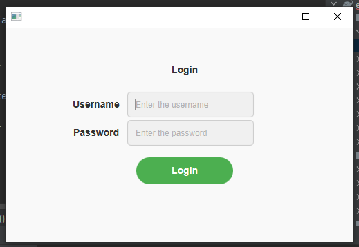
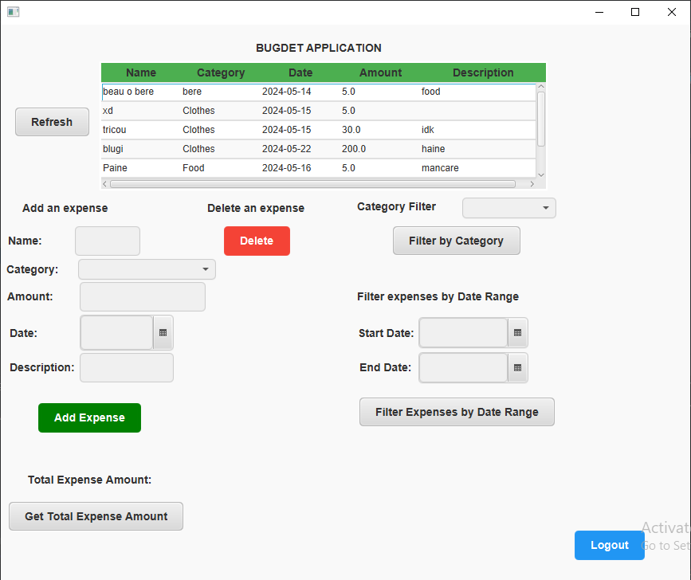

Budget Management Application

Description

This is a simple budget management application built using JavaFX. It allows users to log in and manage their expenses by adding, deleting, filtering, and calculating total expenses.

Features

User Authentication: Secure login system.

Expense Management:

Add new expenses with name, category, amount, date, and description.

Delete existing expenses.

Filter expenses by category.

Filter expenses by date range.

Calculate total expense amount.

User Interface:

Intuitive UI with buttons for various actions.

Responsive design with a structured layout.

Screenshots







Technologies Used

Java

JavaFX

SQLite (for database)

Log4j2 (for logging)

Installation & Usage

Clone the repository:
```bash
git clone https://github.com/your-user/repo-name.git
```

Open the project in your preferred Java IDE (e.g., IntelliJ IDEA, Eclipse).

Ensure you have JavaFX configured.

Run the Main class to start the application.

Configuration

Modify log4j2.xml for logging settings.

Update database connection details if required.

Future Improvements

Add user registration functionality.

Implement export feature (CSV, PDF reports).

Enhance UI with more styling and animations.
